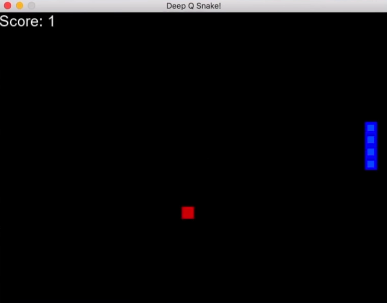
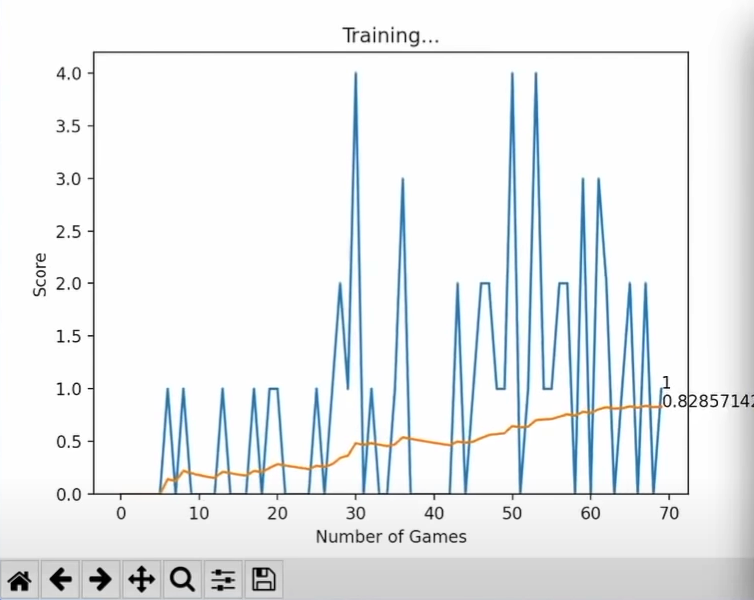
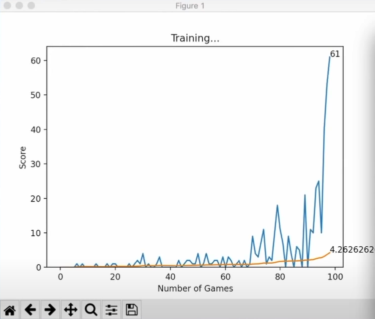
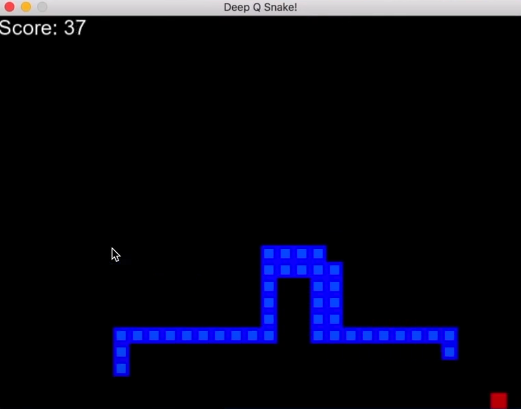

# Snake Game with Reinforcement Learning

This project focuses on creating a reinforcement learning (RL) model that learns how to play the Snake game. The model uses deep Q-learning (DQN) to learn optimal actions based on the state of the game. The ultimate goal of the project is to create an AI agent capable of playing Snake by continuously improving its performance through self-play.

  

## Project Overview

In this project, I implemented a **Reinforcement Learning (RL) model** using the following components:
- **Deep Q-Learning Network (DQN)**: A neural network is used to predict the Q-values for various actions the agent can take in each state.
- **Snake Game Environment**: The game environment is modeled where the agent (snake) takes actions, receives rewards, and learns over time.
- **Training Process**: The RL model is trained over a series of episodes, during which it explores and refines its strategy to maximize the cumulative reward.

<table style="border-collapse: separate; border-spacing: 20px;">
    <tr>
        <td></td>
        <td></td>
    </tr>
    <tr>
        <td></td>
        <td></td>
    </tr>
</table>

## Key Features

- **Deep Q-Network (DQN)**: The agent uses a neural network to estimate the action-value function for state-action pairs.
- **Replay Memory**: The model stores previous experiences in a replay memory buffer to sample mini-batches for training.
- **Epsilon-Greedy Exploration**: The agent balances exploration and exploitation using an epsilon-greedy policy, where it occasionally explores random actions.
- **Target Network**: A target network is used to stabilize training by updating periodically.

## Project Components

### 1. **Reinforcement Learning Model**

The RL model is built using PyTorch. The model consists of a simple feed-forward neural network (Linear_QNet) that takes the current state of the game as input and outputs Q-values for possible actions. The model is trained using the Q-learning algorithm.

### 2. **QTrainer Class**

The `QTrainer` class handles the training process by calculating the loss between the predicted Q-values and the target Q-values, then updating the model's weights using backpropagation.

### 3. **Snake Game Environment**

The game environment is built using the `pygame` library. The snake navigates the environment, eats food, grows, and tries to avoid collisions with itself or the walls.

### 4. **Progress Tracking**

A custom progress tracking system is implemented using `matplotlib` to visualize the agent’s performance over time. This allows monitoring of both the current score and the average score over the course of training.

### 5. **Human Playable Version**

In addition to the RL agent, I also implemented a **human-playable version** of the game using `pygame`. Players can control the snake using the arrow keys and try to achieve the highest score while avoiding collisions.

## File Structure

- `snake_game.py`: Main script for the RL model and the snake game environment.
- `dqn_model.py`: Contains the definition of the `Linear_QNet` model and `QTrainer` class.
- `progress_tracking.py`: A script for visualizing the agent's training progress.
- `human_playable.py`: Implements the human-playable version of the Snake game.

